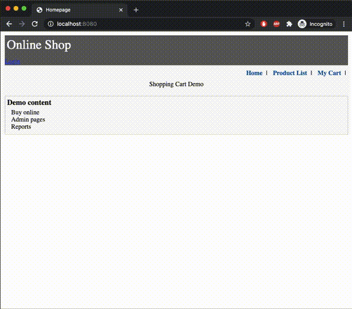

# SpringBoot_ShoppingCart

## Introduction ##

In this project, I've created a simple shopping cart system and:
- Implemented REST API with CRUD operations on MySQL
- Designed authentication and authorization mechanism using Spring security
- Validated user input data and stored to the database
- Displayed products page by page using pagination
- Deployed to Google Cloud Platform(GCP): https://shoppingcart-dot-shoppingcart-springboot.uc.r.appspot.com/

## Environement ##

### Local ###

I used **Spring Boot** framework, **MySQL** database, and **Hibernate ORM** to connect the application and the database. **Apache Tomcat** server is used by default in Spring framework.

### Cloud ###

I've deployed this application to [Google Cloud Platform (GCP)](https://console.cloud.google.com) App Engine, which is a Platform as a Service (PaaS). The required [app.yaml](https://github.com/Hong-Jie/SpringBoot_ShoppingCart/blob/deploy-gcp/SprBootShoppingCart/src/main/appengine/app.yaml) file and the required modifications can be found on branch [deploy-gcp](https://github.com/Hong-Jie/SpringBoot_ShoppingCart/tree/deploy-gcp/SprBootShoppingCart). 

[Click here](https://shoppingcart-dot-shoppingcart-springboot.uc.r.appspot.com/) for the deployed shopping cart.

## Usage ##

This shopping cart system allows three credentials: customer, employee, and manager.
1. **Customers** are not required to login. They can buy multiple products, set whatever amount they want to buy, and input their information when they finish buying products. The system will then show the cart and the total cost to the customer and ask them to confirm. Once the customer confirms, the order will be saved to the database.
2. **Employees** have to login. They can buy products just as customers and they can view orders in the database.
3. **Managers** have to login. They can buy products, view orders, and create products.

The below GIF files show different access for different users. For convenience purpose, I put the username/password of the employee and the manager below the login page.

**Customer**  
 

**Employee**  
  

**Manager**  
  

## Implementation ##

- **Entities**: Account, Order, Order detail, Product.  
Order saves the user information and multiple order details. Order detail saves the order it belongs, a product and the amount of the products, and the total.
- **DAOs**: Account, Order, Product
JPA EntityManager is used to create query and persist to MySQL database.
- **Model**: CartInfo, CartLineInfo, CustomerInfo, OrderInfo, OrderDetailInfo, ProductInfo
These model are used by Controllers to manage and process data.
- **Controller**: MainController, AdminController
Controllers handle HTTP requests and responses. The MainController controlls the process of customers buying products, while AdminController controlls the other operations requiring credentials.
- **Security**: Spring securiy is used in maven dependencies to authenticate and authorize user's operations.
- **Form Validation**: Common Validator is used in maven dependencies to validate the input of user information.

## References ##

This project is inspired by [o7planning](https://o7planning.org/en/11669/spring-boot)
